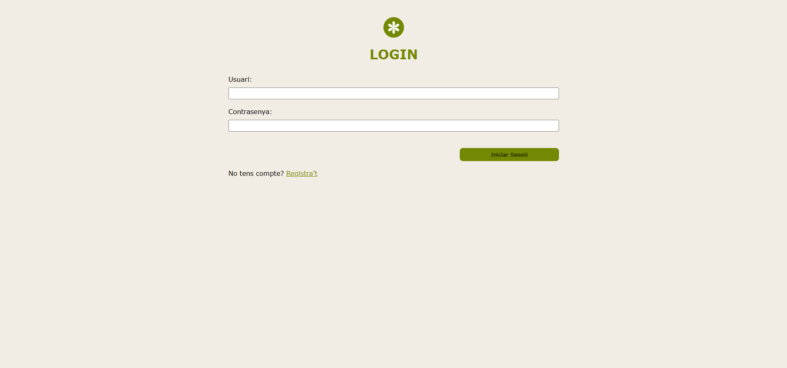

# Plantarium

Aquest projecte és una petita aplicació web que mostra informació sobre flors i arbres. Està construïda amb Node.js, Express i EJS per a les plantilles. Inclou autenticació bàsica amb JSON Web Tokens i gestió d'usuaris en un repositori local (fitxers JSON).

## Què fa aquesta web

- Pàgines per llistar i visualitzar informació de flors i arbres.
- Formularis per afegir i editar elements (flors i arbres).
- Autenticació d'usuaris (registre, login, logout) amb JWT i cookies.
- Rutes protegides que només es poden accedir si l'usuari està autenticat.

## Estructura del projecte

Arbre de carpetes rellevant:

- `index.js` - punt d'entrada de l'aplicació.
- `package.json` - dependències i scripts (conté `npm run dev`).
- `config.js` - configuracions (PORT, SECRET_JWT_KEY, ...).
- `authMiddleware.js` - middleware d'autenticació.
- `user-repository.js` - lògica d'usuaris (registre i login).
- `controllers/` - controladors de lectura/escriptura a la base de dades local.
- `routes/` - rutes per flors (`flowerRoutes.js`) i arbres (`treeRoutes.js`).
- `views/` - plantilles EJS per a les pàgines (home, login, register, flowers, trees, forms...).
- `public/` - fitxers estàtics (CSS, JS, imatges).
- `db/` - fitxers JSON amb dades (p. ex. `db.json`, `User.json`).

Exemple breu (només arxius principals):

```
plantarium/
├─ index.js
├─ package.json
├─ config.js
├─ authMiddleware.js
├─ user-repository.js
├─ controllers/
│  └─ db.controller.js
├─ routes/
│  ├─ flowerRoutes.js
│  └─ treeRoutes.js
├─ views/
│  ├─ home.ejs
│  ├─ flowers.ejs
│  ├─ trees.ejs
│  ├─ form.ejs
│  └─ form-edit.ejs
├─ public/
│  ├─ css/
│  └─ js/
└─ db/
	└─ db.json
```

## Tecnologies

- Node.js
- npm


## Passos

Segueix aquests passos al teu ordinador (PowerShell):

1. Clona el repositori i entra a la carpeta del projecte `plantarium`:


2. Instal·la les dependències:

```powershell
npm install
```

3. Executa l'aplicació en mode desenvolupament (s'utilitza `nodemon` per recarregar automàticament):

```powershell
npm run dev
```

4. Obre el navegador a:

```
http://localhost:3000
```

Nota: el port per defecte es configura al fitxer `config.js`. Canvia la variable d'entorn o edita `config.js` si és necessari.


## Rutes principals

- GET / - pàgina principal (redirecciona a `/protected` si no hi ha sessió).
  
- GET /register - formulari de registre.
- POST /register - registre d'usuari.
  
- GET /login - formulari de login.
- POST /login - login i generació de cookie JWT.
  
- POST /logout - esborra la cookie i tanca sessió.
  
- GET /flors - llistat de flors (ruta protegida).
- GET /flors/:id - detall de la flor (ruta protegida).

   
- GET /arbres - llistat d'arbres (ruta protegida).
- GET /arbres/:id - detall de l'arbre (ruta protegida).
  
    
- GET /form - formulari per crear plantes (flors i arbres).
- GET /form-edit?id=ID - formulari per editar un element amb l'ID donat.


## Vistes


- Home

    

    Aquesta vista mostra l'accés als llistats de flors i arbres, i l'estat de sessió de l'usuari (nom i opció de logout).

- Protected

    

    Pàgina que informa que el contingut és protegit; ofereix enllaços per iniciar sessió o registrar-se.

- Login

    

    Formulari per iniciar sessió i generar la cookie JWT d'accés.

- Register

    

    Formulari per crear un nou compte d'usuari.

- Flors (llistat)

    

    Vista amb totes les flors disponibles i accés als detalls. També pots accedir al formulari per editar i eliminar la flor.

- Detall

    

    Mostra la informació completa d'una flor o arbre.

- Arbres (llistat)

    

    Vista amb els arbres emmagatzemats i possibilitat d'accedir a detalls, editar o eliminar.

- Formulari: afegir

    

    Formulari per crear (POST) una nova planta, tant flor com arbre.

- Formulari: editar

    

    Formulari per editar dades existents d'una planta (GET per carregar el formulari, POST per enviar els canvis segons la implementació).

- Register


## Autora

irie-yamashita


